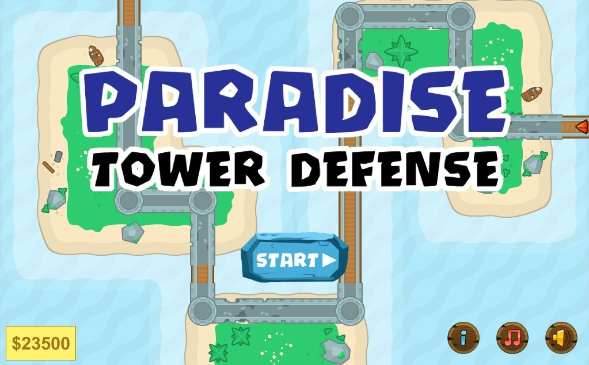
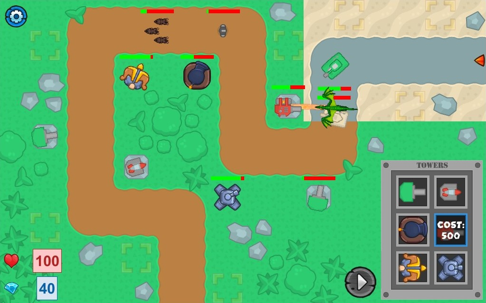
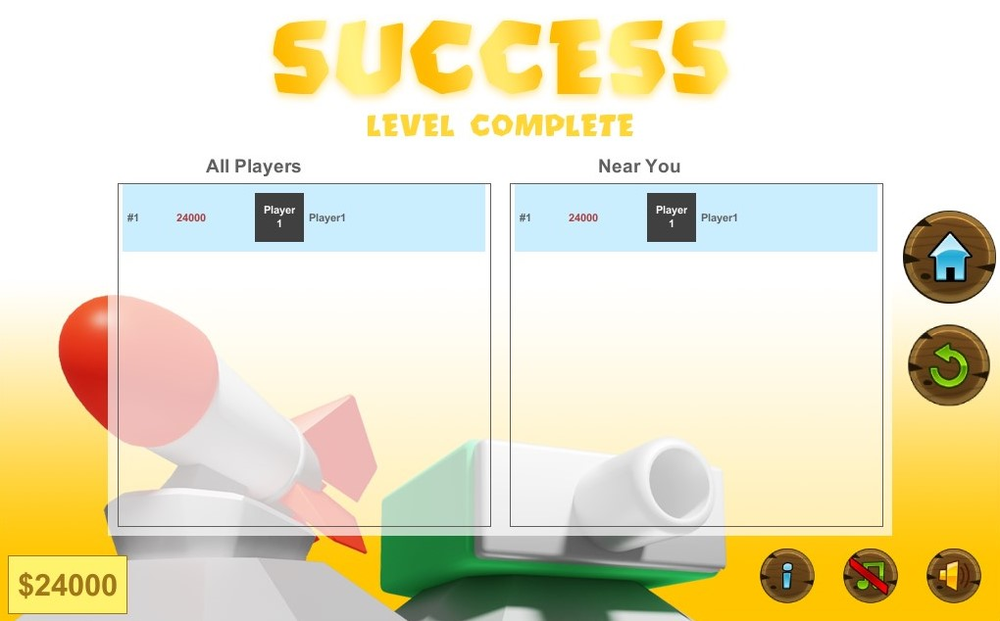

# Paradise Tower Defense
 A cool tower defense game, created for my culminating Grade 12 Computer Science project! Enjoy!

## Playing on the Greenfoot Gallery
1. Go to [Greenfoot Gallery](https://www.greenfoot.org/scenarios/28182).
2. Click the "Run" button under the scenario.
3. Enjoy!

## Playing Locally on Your Device
1. Download [Greenfoot](https://www.greenfoot.org/download) (Greenfoot is an IDE for creating games and simulations).
2. Download the [ParadiseTowerDefense.gfar](ParadiseTowerDefense.gfar) file.
3. Open the PradiseTowerDefense.far file. This will create a folder with all the classes and other assets.
4. Click on the project.gfar file in the folder that was created.
5. When the scenario is finished loading, click the "Run" button and enjoy!

## A Quick Overview...
Paradise Tower Defense is a tower defense game including six different levels. In each of these levels, enemies will be spawned every wave, and it will be your job to place towers on designated spots throughout the map to prevent them from reaching the end!

## Specifics
- The game includes 6 different levels, each with their own map and enemy waves
- There are 5 different types of enemies, the dragon, tank, robot, humanoid, and wolf, each with their own properties
- Similarily, there are also 6 types of towers, the single shoot, single launcher, archer, laser tower, cannon, and flamethrower
- Towers can be placed on the marked tiles (yellow mark)
- The towers, along with the dragon and the tank each fire projectiles, with a total 7 different projectiles (dragon and flamethrower share their fireball)
- Includes 3 different soundtracks that the user can shuffle through using the music button
- User can turn on or off the SFX by clicking on the SFX button
- User wins if they pass all the waves without losing all their health

